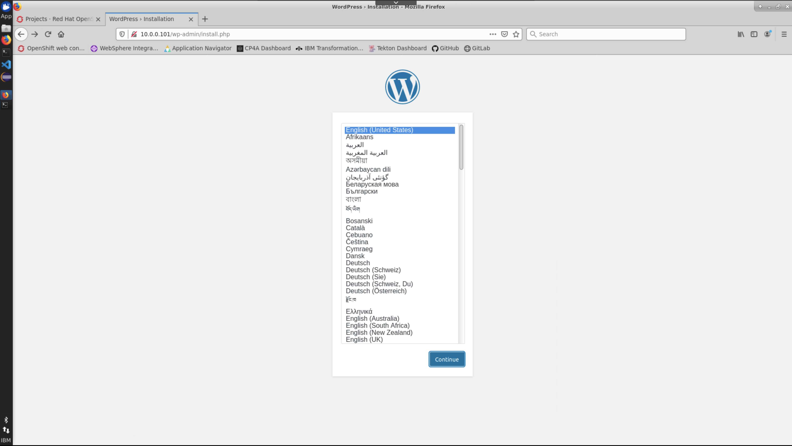

# Exercise 3 - Networking Two Containers

In the previous exercises, we've explored creating single stateless and stateful containers, but that isn't as useful in the real world. This exercise will explore how to create a new docker network and allow two containers to communicate by using a WordPress front end and a MySQL back end.

First, create a new docker network.

```
$ sudo docker network create wordpress-net
4dfcce6edefb60d19f0bb5e89f59fbd5d6a5bd3e463d958ff631536b19359eab
```

View the new network using `docker network ls`

```
$ sudo docker network ls
NETWORK ID          NAME                DRIVER              SCOPE
5112a250b87a        bridge              bridge              local
a3d426053553        codewind_network    bridge              local
62c5819d603b        host                host                local
d90b4ca2a19e        none                null                local
4dfcce6edefb        wordpress-net       bridge              local
```

Create the back end MySQL container, similar to how we did in the previous exercise, this time using the new network as a parameter `--network=wordpress-net`.

```
$ sudo docker run --name wordpress-db -e MYSQL_USER=user -e MYSQL_PASSWORD=passw0rd -e MYSQL_DATABASE=wordpress -e MYSQL_ROOT_PASSWORD=passw0rd -v /tmp/wordpress/mysql/:/var/lib/mysql -d --network wordpress-net mysql:5.6
```

```
$ sudo docker run -e WORDPRESS_DB_PASSWORD=passw0rd -e WORDPRESS_DB_HOST=wordpress-db:3306 --name wordpress -p 80:80 -v /tmp/wordpress/html:/var/www/html -d --network wordpress-net wordpress
```

Open your browser and go to the IP address of your Workstation VM (you can find the IP using the terminal by typing `ifconfig ens33`)

This should bring up the Wordpress installation page



Continue to set up the wordpress application until you get to the dashboard. At this point, you will have created a user, with some details that would be stored in the MySQL database. You can restart the `wordpress-db` or `wordpress` containers using `docker restart [CONTAINER]` as many times as you like and it will behave like a normal application, as Wordpress is persisting data to the local filesystem using MySQL.

## Clean up
```
$ sudo docker rm $(sudo docker stop wordpress-db)
$ sudo docker rm $(sudo docker stop wordpress)
```

Lab complete. Please move on to [Building a custom Docker image](custom-docker-image-ex-4.md)