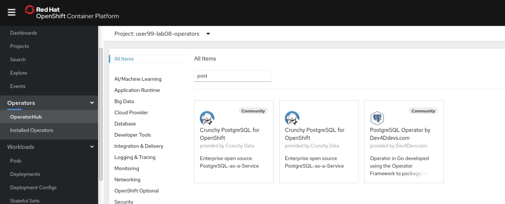
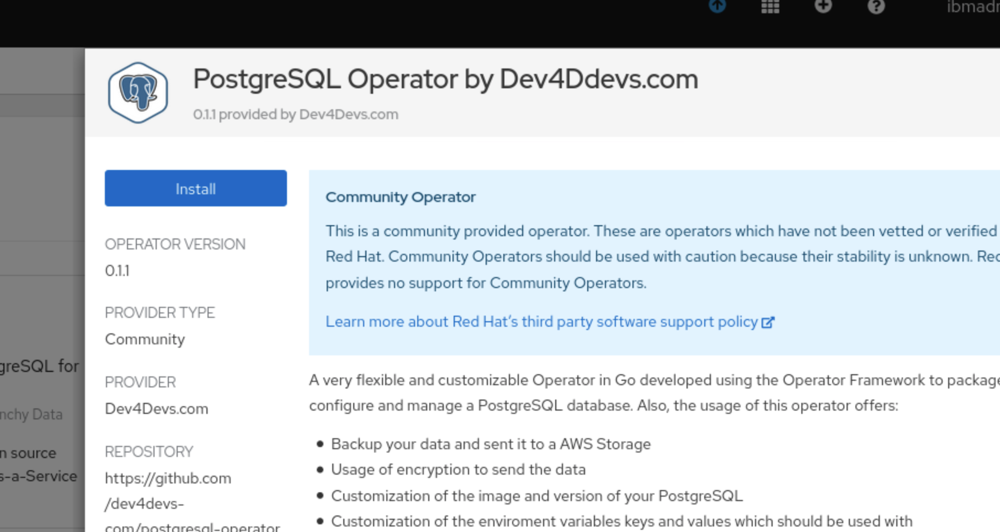
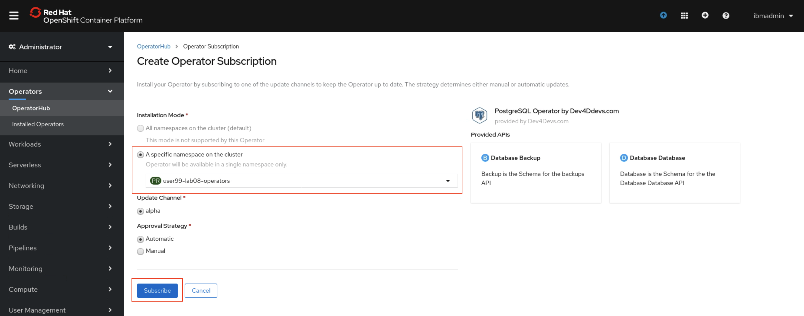
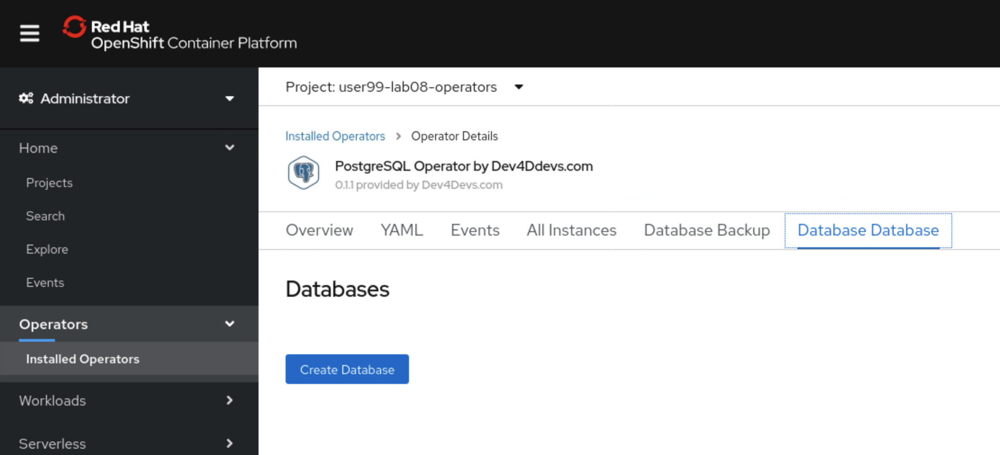
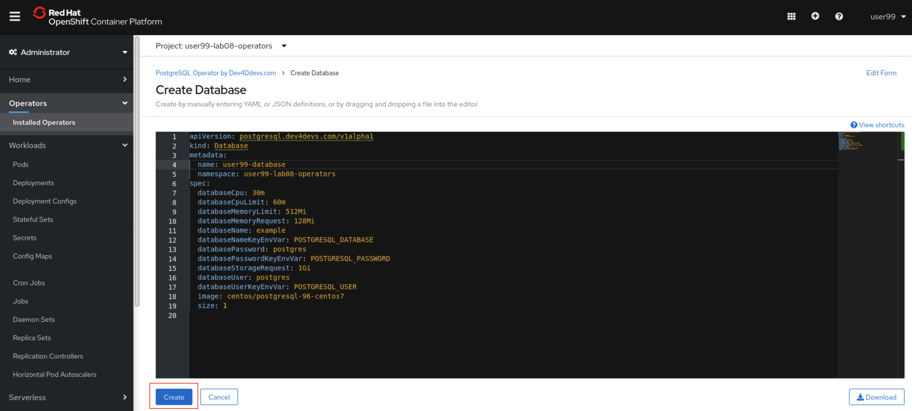

# Exercise 1 - Deploying an Operator

In this lab you'll explore how the cluster administrator can make a PostgreSQL Operator available from the OperatorHub to other users in the cluster so they can install PostgreSQL applications managed by the PostgreSQL Operator.

This lab will be executed in three parts

1. Use the developer to create the project
2. Use the Cluster Administrator to install the Operator
3. Use the developer to create the application from the installed Operator

## Part 1 - Create the Project

First we need to log in with a non-admin role and create a project similar to `lab08-operators`. For the developer role, we'll use the `ibmuser` user.

Log into OpenShift using the CLI with the user `ibmuser`, as described [here](../Getting-started/log-in-to-openshift.md).

Create the project as this user

```
$ oc new-project lab08-operators
```

## Part 2 - Install the Operator

Now we should take the role of the Cluster Administrator to make the PostgreSQL Operator available.

Log in as the cluster-admin `ibmadmin` user. Only administrative users can install operators to projects. Once an operator has been installed to a project, developers with access to that project can consume the operator Custom Resources to create applications.

```
$ oc login https://api.demo.ibmdte.net:6443 -u ibmadmin -p engageibm
```

From the navigation pain, select Operators > OperatorHub


In the search bar, enter `postgresql` and then select the PostgreSQL Operator



Select 'Install'



On the Subscription page, select the option for 'A specific namespace in the cluster', then select the namespace you created in Part 1.



Select 'Subscribe'

The PostgreSQL Operator should begin installing to the selected project. 


This may take a short amount of time to start up.

The existing user `ibmuser` only has a basic-user role, so we need to upgrade some of their privileges to they can create and edit resources in the `lab08-operators` project. Do this with the following

```
$ oc adm policy add-role-to-user edit ibmuser -n lab08-operators
```

We can now log out of the Web Console with the `ibmadmin` user and log in again with our developer user.

## Part 3 - Install a Database from the PostreSQL Operator

Now log back into the Web Console as the developer user `ibmuser`.

From the project selection box, select the project you created at the start of this lab, for example, `lab08-operators`. In the navigation pane, select Operators > Installed Operators, then select the PostgreSQL Operator. You may need to use the search box if you have a lot of Operators installed to this project.


Select the 'Database Database' tab.



This page will allow you to create a new instance of a PostgreSQL database. The YAML provided is perfectly valid to deploy as it is, so we do not need to make any changes other than changing the `name` field to include our username. Use the below YAML as an example.

```
apiVersion: postgresql.dev4devs.com/v1alpha1
kind: Database
metadata:
  name: database
  namespace: lab08-operators
spec:
  databaseCpu: 30m
  databaseCpuLimit: 60m
  databaseMemoryLimit: 512Mi
  databaseMemoryRequest: 128Mi
  databaseName: example
  databaseNameKeyEnvVar: POSTGRESQL_DATABASE
  databasePassword: postgres
  databasePasswordKeyEnvVar: POSTGRESQL_PASSWORD
  databaseStorageRequest: 1Gi
  databaseUser: postgres
  databaseUserKeyEnvVar: POSTGRESQL_USER
  image: centos/postgresql-96-centos7
  size: 1
```



When ready, select 'Create'.

This should begin the deployment process and we can check the state of our new database pods.

In the navigation pane, go to Workloads > Deployments then select the `database`, or the name you gave to your database application in the previous step.


Here, we can select the 'Pods' tab and see if our PostgreSQL database pod is running.


We have successfully installed an Operator in a developer project and the developer user has created a new application from this Operator.

Lab complete.

When you're finished, please clean up the resources created and delete the project.