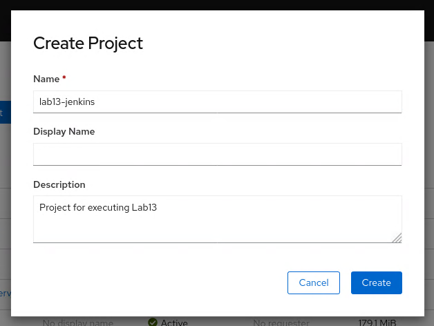
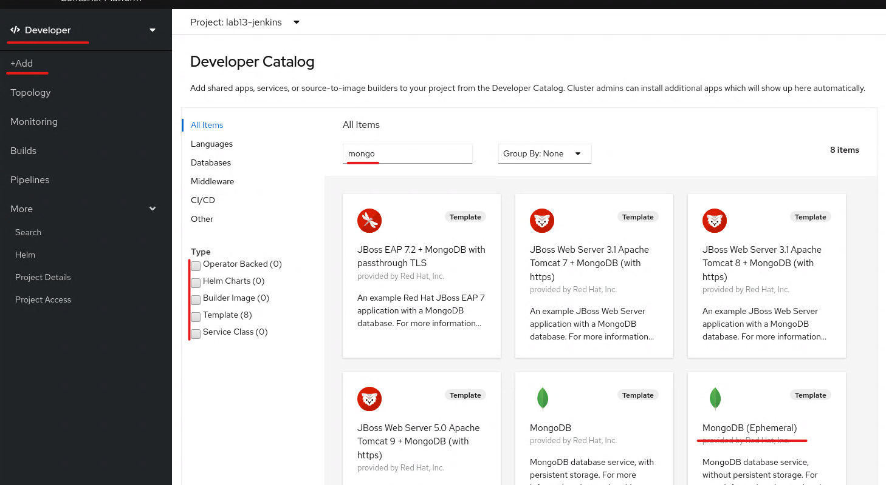

# Exercise 1 - Deploying Applications with Jenkins CI/CD

In this lab we'll explore how to use Jenkins to build and deploy application on OpenShift.
Sample Guest book application is used that uses IBM Liberty and Mongo DB. 

## Setup project
To get started, log into OpenShift using the Web Console, as described [here](../Getting-started/log-in-to-openshift.md).

Once you're logged in, create a new project for this deployment. Go to Home > Projects in the navigation pane, then select 'Create Project'

In the 'Create Project' dialogue box that appears, use the naming format `lab13-jenkins`. Completing the Display Name and Description fields are recommended, but optional.

## Deploy Mongo DB
The application is using Mongo DB to store guests data. We need to deploy it to our cluster first. 
In this lab, we're going to deploy a new application using the 'From Catalog' option. This option allows to deploy images that are available in your OpenShift cluster. In the navigation pane, switch the console view from Administrator to Developer, then select '+Add', and click 'From Catalog' option. In the text field start typing `mongo`. For simplicity we will use ephemeral version of this database. If you dont see Mongo Template make sure that all types are unchecked.

Click `Instantiate Template` to deploy Mongo DB instance in your project.

In the template provide following details:

- Make sure that namespace displays "PR lab13-jenkins"
- MongoDB Connection Username: mongo
- MongoDB Connection Password: mongo
- MongoDB Database Name: mydb
- MongoDB Admin Password: mongo

Accept other defalut values and click `Create` button.

To verify that instance is correctly deployed switch to the Administator view, and click Workloads > Pods. You should have pod with mongo successfully running.

